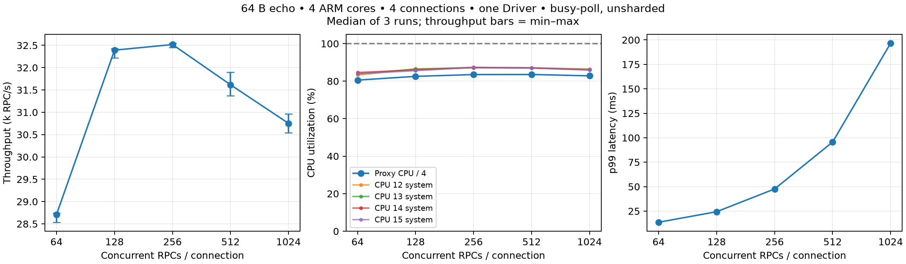

# 4-core gRPC-go: in-flight RPC 증가와 CPU 사용률

실행: 2026-09-28 23:55:05 UTC – 2026-09-28 23:59:24 UTC.
Connection당 동시 RPC를 64에서 1,024까지 늘렸다.
Proxy CPU 합계의 최대 중앙값은 **334.2% / 400%**였다.
최대 부하 조건의 물리 core별 사용률 중앙값은 **85.9–86.5%**다.
측정한 범위에서 동시 RPC 설정 증가로 4개 core를 모두 100% 채우지는 못했다.

## 조건

- DPU ARM cores 4개(CPU 12–15), Tokio workers 4개. `DMESH_SHARDED` unset, `DMESH_BUSY_POLL=1`, `dpu-dma`.
- Comch/Driver 1개, shared DPA context 1개, 32-slot DPA thread pool. Client connection 4개와 backend pool 4개 고정.
- Host client/server 각 1 OS process, `GOMAXPROCS=8`; client CPU 0–7, server CPU 8–15.
- 64B application payload unary gRPC echo. Connection당 concurrent RPC 설정 64/128/256/512 및 필요 시 1,024. 전체 동시 요청 설정은 이 값의 4배다.
- 여기서 concurrency는 client의 closed-loop 동시 `Invoke` 수다. HTTP/2 stream slot/flow control 대기도 포함할 수 있으며 모든 요청이 동시에 wire/DPU에 도착했다는 뜻은 아니다. Wire상의 active stream 수는 계측하지 않았다.
- 각 조건 warmup 3초, 측정 10초, 3회 반복. RPC deadline 5초. Payload 검증과 native dial/reconnect/close 검사를 유지했다.
- 같은 조건의 3회는 proxy/server를 유지하며 새 client process로 실행. 부하 조건이 바뀔 때 proxy/server를 새로 시작했다. 64→128→256→512 순서로 측정했고, CPU가 포화되지 않아 1,024를 추가했다.
- 512에서 1,024로 확장하는 사전 실행 기준은 proxy CPU 중앙값 <390% 또는 물리 core 중 하나의 중앙값 <98%였다. 이는 다음 부하를 실행할 기준이며 100% 포화 판정을 대체하지 않는다.
- 직전 [4-core/connection scaling 평가](2026-09-28_grpc-go-64b-unsharded-busy-poll.md)와 같은 proxy/host library/Go bench 바이너리를 SHA로 확인하고 재사용했다. 이번에는 1초 CPU 샘플도 추가하고 DPU 관측 process를 CPU 0–3에 두었다.
- Baseline 64도 이번 suite에서 다시 측정했다. DPU PF/representor `03:00.1`/`0b:00.1`, host Comch PF `0b:00.1`. Mock controllers는 DPU CPU 0–3.
- Inbound/outbound MAX_IN_FLIGHT 및 SERVER_HTTP2_MAX_CONCURRENT_STREAMS 환경변수 override는 없었다. 다른 transport/runtime tuning이나 NIC/SF/EU partition 변경 없음.

## 결과

| RPC/connection | Total concurrency | RPC/s median (min–max) | p99 ms | Proxy CPU % | CPU12 / 13 / 14 / 15 % | Host client/server CPU % |
| ---: | ---: | ---: | ---: | ---: | --- | ---: |
| 64 | 256 | 28,711.2 (28,536.3–28,746.1) | 13.607 | 322.2 | 83.2 / 84.0 / 84.6 / 83.9 | 189.3 / 215.0 |
| 128 | 512 | 32,392.1 (32,221.6–32,429.5) | 24.374 | 330.2 | 86.6 / 86.4 / 85.9 / 85.6 | 196.9 / 233.7 |
| 256 | 1024 | 32,517.6 (32,449.6–32,547.7) | 47.639 | 334.0 | 87.0 / 87.3 / 87.3 / 87.4 | 198.2 / 241.2 |
| 512 | 2048 | 31,616.5 (31,369.5–31,899.3) | 95.614 | 334.2 | 87.1 / 87.1 / 87.0 / 87.1 | 195.9 / 234.8 |
| 1024 | 4096 | 30,752.2 (30,539.9–30,965.2) | 196.668 | 331.3 | 86.5 / 86.2 / 85.9 / 86.0 | 197.5 / 221.5 |

값은 반복별 결과의 중앙값이다. p99는 전체 반복의 샘플을 합친 percentile이 아니다. Throughput 괄호는 관측 최소–최대이며 confidence interval이 아니다.
최고 처리량 중앙값은 256 RPC/connection에서 32,517.6 RPC/s였다.
64→1024에서 동시 RPC 설정은 16배,
처리량은 +7.1%, p99는 13.607→196.668ms로 변했다.
높은 부하에서 처리량 증가가 줄고 지연이 커졌다. 이 조건에서는 client 동시 RPC 설정을 더 올리는 것만으로 CPU를 모두 채울 수 없었다.
Driver 직렬 구간, HTTP/2 stream/flow-control 대기, scheduler 및 host-side 병목의 기여도는 이 측정만으로 분리하지 않았다.

## CPU 계측

- Proxy CPU 합계는 측정 구간 `/proc/PID/task/TID/stat`의 CPU tick 차이 합계다. **100%가 core 하나, 400%가 네 core**다.
- CPU12–15는 `/proc/stat`에서 idle+iowait를 제외한 비율이다. IRQ 및 다른 process의 CPU 시간도 포함하므로 proxy CPU와 구분한다.
- Tokio thread는 CPU 12–15 사이에서 이동할 수 있다. CPU를 사용하는 4개 proxy thread의 run 평균 범위를 아래에 기록했다. Helper/admin thread는 대부분 0%였다.
- 1초 샘플에서 0.5–1.5초 길이의 유효 구간만 집계했다. 네 system core가 모두 ≥98%인 구간은 **0/150개**다. 원시 timestamp/tick은 raw archive에 있다.

| RPC/connection | Active proxy thread CPU range % across runs | 1-second proxy CPU range % | Intervals with all 4 system cores ≥98% |
| ---: | ---: | ---: | ---: |
| 64 | 77.8–87.0 | 309.3–326.3 | 0/30 |
| 128 | 81.0–84.3 | 326.3–334.1 | 0/30 |
| 256 | 82.5–84.3 | 327.3–337.3 | 0/30 |
| 512 | 83.0–84.1 | 331.3–337.3 | 0/30 |
| 1024 | 82.0–83.6 | 325.3–335.3 | 0/30 |

Busy-poll CPU 사용률만으로 연산 병목을 판정하지 않는다. Host 전체 사용률이 8-core 용량보다 낮아도 특정 goroutine/lock의 병목을 배제할 수 없다.

## 정확성·종료·자료

**15/15회 통과**, 측정 구간 완료 RPC **4,676,943개**.
모든 응답 payload 검증, RPC error 0, reconnect 0, 각 connection의 native dial 1회. 각 case의 host server exit 0과 shared context destroy를 확인했다.
장시간 idle 후 재연결 검증은 포함하지 않았으며 앞선 event-mode DPA fatal 문제를 수정한 실험은 아니다.

- [Run별 CSV](2026-09-28_grpc-go-64b-4core-inflight.csv), [작은 결과 JSON](2026-09-28_grpc-go-64b-4core-inflight.json), [PNG](2026-09-28_grpc-go-64b-4core-inflight.png).
- 양쪽 실행 경로 `/tmp/dmesh-inflight-20260928`. Scripts: `launch.sh`, `host.py`, `run_client.py`, `suite.py`, `stop.py`, `report.py`.
- Host command는 `channel-bench -mode client -connections 4 -concurrency TOTAL -warmup 3s -duration 10s -rpc-timeout 5s -start-file PATH`; `TOTAL=4*RPC_PER_CONNECTION`.
- Host binary/library는 `/tmp/dmesh-unsharded-20260928/channel-bench`, `source/build/lib/libdpumesh.so.5`. 정확한 SHA와 root/proxy HEAD는 JSON의 identity 참조. 미커밋 global DPA context 변경을 포함한 동일 working tree다.
- Host/DPU 로그·CPU raw samples·스크립트·source snapshot은 로컬 `2026-09-28_grpc-go-64b-4core-inflight-raw.tar.gz`에 보존하며 Git 제외. 보고서/CSV/작은 JSON/PNG는 저장소에 포함한다.

모든 기록된 host/DPU test process의 종료와 잔여 channel-bench process가 없는 것을 확인했다.

Raw archive SHA-256: `8462804f5dab14bb526ed94c8fda4f1c4fc8d8c38f256a6768d6c859d3846765`.
