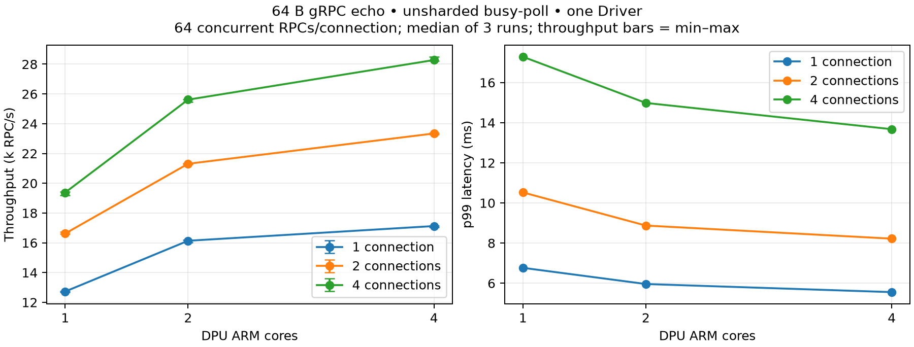

# gRPC-go 64B echo: non-sharded DPU busy-poll

2026-09-28 UTC. **PASS: 9개 조합 × 3회, 총 27회.** 측정 구간 완료 RPC 5,413,470개.
모든 응답 payload 검증, RPC error 0, reconnect 0, client transport close 성공.
각 조합의 server exit 0, proxy shared DPA context destroy와 process 종료를 확인했다.

## 조건

- DPU `DMESH_BUSY_POLL=1`, `DMESH_SHARDED` unset, reverse mode `dpu-dma`.
- Host gRPC-go client/server는 각각 **OS process 1개**. Client connections 1/2/4개, connection당 동시 RPC 64개. 전체 concurrency는 64/128/256개다.
- Comch/Driver는 **항상 1개**(`DMESH_NUM_WORKERS=1`, `DPUMesh0`). DPU shared DPA context 1개, 32-slot DPA thread pool. Connection들을 여러 Comch Driver로 분배하지 않는다.
- DPU ARM core 1/2/4개에 대해 `LINKERD2_PROXY_CORES`와 process affinity를 함께 설정했다. CPU mask는 각각 `15`, `14-15`, `12-15`.
- Core 1개는 Tokio current-thread runtime, 2/4개는 해당 worker 수의 multi-thread runtime. Main/admin/SDK helper thread도 같은 CPU mask를 상속한다. DPA hardware 사용은 ARM core 수와 별개다.
- Host client CPU 0–7, server CPU 8–15, 각각 `GOMAXPROCS=8`. Backend pool 초기/최대 크기는 client connection 수와 같다.
- 64-byte application request/response, gRPC unary raw-codec echo. POSIX preload 경로는 사용하지 않았다.
- Run마다 preflight → warmup 3초 → 측정 10초 → drain/close. RPC deadline 5초. QPS는 측정 구간 완료 RPC / 10초이며 latency는 client에서 관찰한 부하 상태의 RPC latency다.
- 동일 조합에서 proxy/server를 유지하고 새 client process로 3회 반복했다. 다음 조합은 proxy/server를 새로 시작했다. ARM cores 1→2→4, connections 1→2→4 순서로 실행했다.
- DPU PF/host representor `03:00.1`/`0b:00.1`, host Comch PF `0b:00.1`. Mock control plane은 DPU CPU 0–3.
- Native teardown 활성, 기존 로깅 설정 유지. NIC/SF/EU partition 변경 없음. Host library/Go bench는 직전 검증에서 별도 빌드한 동일 artifact를 재사용하고 SHA를 확인했다. 이번 측정을 위한 datapath 소스 변경 없음.

## 결과

| ARM cores | Connections | RPC/s median (min–max) | p50 ms | p99 ms | DPU CPU % | Host client/server CPU % |
| ---: | ---: | ---: | ---: | ---: | ---: | ---: |
| 1 | 1 | 12,726.6 (12,687.1–12,738.4) | 5.063 | 6.766 | 100.0 | 125.0 / 123.5 |
| 1 | 2 | 16,620.5 (16,591.4–16,739.9) | 7.834 | 10.524 | 100.0 | 139.9 / 145.0 |
| 1 | 4 | 19,376.5 (19,179.5–19,416.7) | 13.387 | 17.284 | 100.0 | 149.8 / 159.3 |
| 2 | 1 | 16,136.5 (16,030.9–16,192.2) | 4.084 | 5.959 | 167.0 | 159.0 / 159.6 |
| 2 | 2 | 21,308.0 (21,259.6–21,338.5) | 6.127 | 8.873 | 176.2 | 174.2 / 180.6 |
| 2 | 4 | 25,615.7 (25,450.7–25,618.4) | 9.970 | 14.984 | 184.2 | 181.3 / 201.2 |
| 4 | 1 | 17,124.8 (17,044.3–17,159.8) | 3.732 | 5.556 | 265.9 | 157.0 / 163.3 |
| 4 | 2 | 23,344.9 (23,286.0–23,373.0) | 5.486 | 8.219 | 299.2 | 180.9 / 189.6 |
| 4 | 4 | 28,278.3 (28,212.6–28,496.2) | 9.051 | 13.676 | 320.9 | 188.3 / 212.8 |

Median은 각 반복에서 계산한 값의 중앙값이다. p50/p99는 세 반복의 샘플을 합친 percentile이 아니다.
최소–최대 범위는 3회 관측 범위이며 confidence interval이 아니다.



Connection 4개에서 core 1→2→4의 처리량은 19,376.5→25,615.7→28,278.3 RPC/s다.
1→2 core 증가율은 32.2%, 1→4는 45.9%, 2→4는 10.4%다.
단일 host client/channel과 Driver 하나로도 여러 ARM core 활용과 처리량 증가가 확인된다. Core 수에 비례하는 확장은 아니다.
Driver future 내부 DOCA progress는 직렬이며, 여러 connection의 protocol task가 공유 Tokio runtime에서 실행된다.
이 실험은 Comch Driver 수 증가의 효과를 측정하지 않았다. 정확한 병목의 구분에는 추가 profiling이 필요하다.

## CPU

Proxy/host process CPU는 측정 구간의 `/proc/PID/task/TID/stat` 또는 `/proc/PID/stat` 차이로 계산했다. 100%는 CPU core 하나다.
아래 물리 CPU 번호별 사용률은 `/proc/stat`에서 idle+iowait를 제외한 비율이며 IRQ 및 다른 process의 CPU 시간도 포함한다.
Tokio thread는 지정된 CPU 집합 안에서 이동할 수 있으므로 thread별 CPU와 물리 core별 CPU를 구분한다.

| ARM cores | Connections | Assigned CPU: system utilization median % |
| ---: | ---: | --- |
| 1 | 1 | 15: 100.0 |
| 1 | 2 | 15: 100.0 |
| 1 | 4 | 15: 100.0 |
| 2 | 1 | 14: 97.0, 15: 77.7 |
| 2 | 2 | 14: 96.6, 15: 87.2 |
| 2 | 4 | 14: 94.5, 15: 94.8 |
| 4 | 1 | 12: 72.6, 13: 66.6, 14: 66.0, 15: 68.5 |
| 4 | 2 | 12: 75.7, 13: 81.2, 14: 79.0, 15: 78.2 |
| 4 | 4 | 12: 83.5, 13: 84.3, 14: 83.3, 15: 85.7 |

Busy-poll은 작업이 없을 때도 CPU를 소모하므로 CPU 100%만으로 연산 병목을 확정하지 않는다.
Host process CPU 합계가 할당한 8-core 용량보다 작더라도 특정 goroutine/lock의 병목을 배제할 수 없다.

## 해석 범위 및 이전 측정

동일 부하의 [2026-09-26 sharded 1-core/4-connection 결과](2026-09-26_grpc-go-64b-1core-p4-c256.md)는 19,498.2 RPC/s였다.
현재 1-core/4-connection 중앙값과 수치 차이는 -0.62%다.
코드·빌드와 sharding 구성이 다르므로 이 비교에서 특정 변경의 성능 효과를 분리할 수는 없다.

Host-dpa, 여러 Driver, 8개 이상 ARM core, 장시간 부하와 3분 idle 후 재연결은 이번 성능 평가 범위에 포함하지 않았다.
앞선 [event 구성의 유휴 후 DPA fatal](2026-09-28_grpc-go-unsharded-validation.md)은 미해결 상태다.
이번 PASS는 기록한 busy-poll 실행 및 각 조합의 정상 teardown에 대한 판정이다.

## 재현 및 보존

Client command (K = 1/2/4):

```sh
channel-bench -mode client -connections "$K" -concurrency "$((64*K))" \
  -warmup 3s -duration 10s -rpc-timeout 5s -start-file "$START_FILE"
```

- [Run별 CSV](2026-09-28_grpc-go-64b-unsharded-busy-poll.csv), [환경·결과·CPU·binary SHA JSON](2026-09-28_grpc-go-64b-unsharded-busy-poll.json).
- 실행 당시 양쪽 경로 `/tmp/dmesh-busy-perf-20260928`; suite.py가 proxy 실행/host readiness/3회 측정/종료를 순서대로 수행한다.
- `launch.sh`, `host.py`, `run_client.py`, `stop.py`, `suite.py`, `report.py`, host/DPU 로그, 환경, source snapshot과 working-tree patch를 로컬 `2026-09-28_grpc-go-64b-unsharded-busy-poll-raw.tar.gz`에 보존한다. Archive는 Git 제외.
- Host binary/library 원래 경로는 `/tmp/dmesh-unsharded-20260928/channel-bench`와 `source/build/lib/libdpumesh.so.5`다. 기존 설치본을 덮어쓰지 않았다.
- Root HEAD `b60712998e8b0747fb62f2195716aeeeab6faffb`, proxy HEAD `c09915bfb38cbb8401b4d9136194923a6d23edd2`와 미커밋 global DPA context 변경을 포함한다. 정확한 artifact SHA는 결과 JSON에 기록했다.

Raw archive SHA-256: `796633cddca9c772f0fd4df4f15f658319a26c1ba344729fe0dcff4728de5820`.
