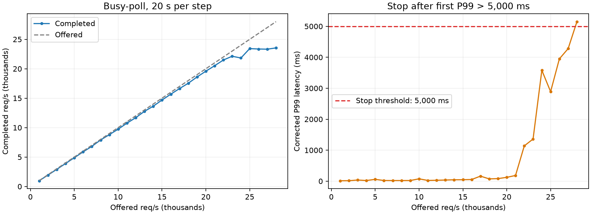

# DSB busy-poll: 1K 단위 load ramp, P99 5초 초과 시 중단

**28,000 req/s 목표 부하에서 P99 5,150.00ms가 5,000ms를 초과해 중단했다.** 이 단계의 실제 처리량은 23,543.35 req/s다.

직전 27,000 req/s에서는 실제 23,323.41 req/s, P99 4,280.00ms였다. 각 부하를 1회씩 측정한 순차 ramp 결과이며 장시간 SLO 보장이나 통계적 한계치로 해석하지 않는다.

## 조건과 중단 규칙

- Busy-poll, dpu-dma, DPU 16 sharded workers, frontend 8, Host 앱 29개/CPU 0–15/GOMAXPROCS=4. 직전 peak 실험과 같은 바이너리 및 기본 배치(Profile worker 10/11)를 사용했다. Profile 이동 대조 실험의 배치는 사용하지 않았다.
- r4 wrk 1 process, 10 load threads, 1,000 connections, exponential distribution, CPU 0–9. 10.8.8.2의 임시 NodePort가 native frontend 포트 15000–15007로 연결을 분산한다.
- 각 단계 20초, 목표 부하 1,000에서 시작해 정확히 1,000 req/s씩 증가. 각 실행의 wrk corrected P99가 **5,000ms 초과**하면 더 높은 부하를 실행하지 않는다. 5,000ms와 같은 경우는 계속한다.
- 초기 idle CPU 20초, 앱 기능 검증 후 1K부터 시작했다. 별도 고부하 warmup은 없다. 단계 사이 3초 대기와 계측 준비 시간이 있으며, 앱/DB를 재시작하지 않고 부하를 올렸다. wrk 프로세스 및 TCP 연결은 단계마다 새로 생성된다.
- Formal 측정에 perf는 사용하지 않았다. DPU /proc 1Hz, Host CPU 약 2Hz를 수집했다. 외부 오류가 있어도 유효 P99가 있으면 요청한 P99 규칙에 따라 진행했으며 오류를 아래에 별도로 표시한다.

실제 command 형식:

```bash
taskset -c 0-9 /tmp/dsb-regression-20260929/wrk -D exp -t10 -c1000 -d20s -L \
  -s /tmp/dsb-busy-ramp-20260929/busy/r<LOAD>/nodeport.lua \
  http://10.8.8.2:30839 -R <LOAD>
```

Lua는 `hotelReservation/wrk2/scripts/hotel-reservation/mixed-workload_type_1.lua`와 같은 mixed-workload이며 base URL만 NodePort로 바꿨다. 각 실행의 전체 command와 원본 Lua는 raw archive에 보존했다.

## 전체 결과

| 목표 req/s | 실제 req/s | P99 ms | DPU proxy cores | Host physical cores | HTTP 오류 | Socket 오류 | 내부 RPC 오류 |
|---:|---:|---:|---:|---:|---:|---:|---:|
| 1000 | 974.69 | 13.42 | 15.60 | 2.63 | 0 | 1254 | 0 |
| 2000 | 1936.38 | 14.68 | 15.77 | 4.34 | 0 | 217 | 0 |
| 3000 | 2907.13 | 36.26 | 15.48 | 5.96 | 0 | 41 | 0 |
| 4000 | 3896.13 | 20.82 | 15.57 | 7.44 | 0 | 7 | 0 |
| 5000 | 4886.44 | 58.49 | 15.55 | 8.62 | 0 | 0 | 3 |
| 6000 | 5873.06 | 21.74 | 15.55 | 9.78 | 0 | 1 | 0 |
| 7000 | 6811.87 | 19.84 | 15.48 | 10.57 | 0 | 0 | 0 |
| 8000 | 7898.87 | 19.97 | 15.30 | 11.28 | 0 | 0 | 0 |
| 9000 | 8807.84 | 20.94 | 15.52 | 11.65 | 0 | 0 | 0 |
| 10000 | 9735.68 | 75.20 | 15.09 | 12.07 | 0 | 0 | 0 |
| 11000 | 10750.30 | 23.23 | 15.46 | 12.60 | 0 | 0 | 0 |
| 12000 | 11682.95 | 28.94 | 15.34 | 12.92 | 0 | 0 | 54 |
| 13000 | 12760.06 | 36.48 | 15.34 | 13.21 | 0 | 0 | 1 |
| 14000 | 13637.29 | 44.80 | 15.42 | 13.35 | 0 | 0 | 4 |
| 15000 | 14684.79 | 46.46 | 15.08 | 13.44 | 0 | 0 | 1 |
| 16000 | 15679.37 | 53.53 | 15.27 | 13.57 | 0 | 0 | 2 |
| 17000 | 16634.56 | 162.30 | 15.07 | 13.62 | 0 | 0 | 37 |
| 18000 | 17541.45 | 73.41 | 15.38 | 13.88 | 0 | 0 | 43 |
| 19000 | 18607.66 | 82.18 | 15.33 | 14.16 | 0 | 0 | 9 |
| 20000 | 19584.18 | 123.26 | 15.27 | 14.37 | 0 | 0 | 8 |
| 21000 | 20515.16 | 183.81 | 15.33 | 14.50 | 0 | 0 | 159 |
| 22000 | 21483.86 | 1140.00 | 15.01 | 14.58 | 0 | 0 | 212 |
| 23000 | 22125.06 | 1360.00 | 15.32 | 14.76 | 0 | 0 | 210 |
| 24000 | 21827.67 | 3580.00 | 14.87 | 14.54 | 0 | 0 | 85 |
| 25000 | 23424.17 | 2890.00 | 15.35 | 14.96 | 0 | 0 | 135 |
| 26000 | 23356.12 | 3950.00 | 15.27 | 14.89 | 0 | 0 | 73 |
| 27000 | 23323.41 | 4280.00 | 15.38 | 14.91 | 0 | 0 | 17 |
| 28000 | 23543.35 | 5150.00 | 15.38 | 14.92 | 0 | 0 | 2 |

CPU cores는 CPU 시간 합계다(100%=1코어). DPU proxy CPU와 물리 코어 busy는 별도 지표이며 JSON/CSV에 모두 기록했다. Busy-poll CPU에는 유효 처리뿐 아니라 idle polling이 포함된다. 내부 RPC 오류는 backend 계수 차이이며 원인별 분류를 하지 않았다.



## 중단 단계의 DPU 코어별 사용률

| CPU | Worker | Physical busy % | Worker CPU % |
|---:|---:|---:|---:|
| 0 | 15 | 98.89 | 95.81 |
| 1 | 14 | 98.83 | 96.35 |
| 2 | 13 | 98.89 | 96.68 |
| 3 | 12 | 98.89 | 95.48 |
| 4 | 11 | 99.11 | 96.73 |
| 5 | 10 | 99.05 | 91.07 |
| 6 | 9 | 99.16 | 96.95 |
| 7 | 8 | 99.16 | 96.73 |
| 8 | 7 | 99.16 | 96.51 |
| 9 | 6 | 99.22 | 96.89 |
| 10 | 5 | 98.77 | 95.70 |
| 11 | 4 | 98.83 | 95.86 |
| 12 | 3 | 99.61 | 98.09 |
| 13 | 2 | 99.11 | 96.84 |
| 14 | 1 | 99.11 | 95.70 |
| 15 | 0 | 99.05 | 96.68 |

## 오류 및 정리

- r1000: [{"non2xx": 0, "socket_errors": {"connect": 0, "read": 0, "write": 0, "timeout": 1254}, "exit": 0}]
- r2000: [{"non2xx": 0, "socket_errors": {"connect": 0, "read": 0, "write": 0, "timeout": 217}, "exit": 0}]
- r3000: [{"non2xx": 0, "socket_errors": {"connect": 0, "read": 0, "write": 0, "timeout": 41}, "exit": 0}]
- r4000: [{"non2xx": 0, "socket_errors": {"connect": 0, "read": 0, "write": 0, "timeout": 7}, "exit": 0}]
- r6000: [{"non2xx": 0, "socket_errors": {"connect": 0, "read": 0, "write": 0, "timeout": 1}, "exit": 0}]
- 총 28개 부하 단계. DPA lifecycle: {"contexts": 1, "pool_assign": 115, "pool_release": 115}.
- Host 앱 29개와 proxy 정상 종료. 측정용 Compose, Service/EndpointSlice, 10.8.8.2/24 임시 IP를 제거하고 Host source config를 복원했다. 기존 frontend Service는 변경하지 않았다.

## 원본 자료

2026-09-29_dsb-busy-load-ramp-raw.tar.gz (로컬 보존, Git 제외)

SHA-256: `7b01d206beec11b6415e4c1010f9997c8545cb22ec553495bfc4c363e356e012`
