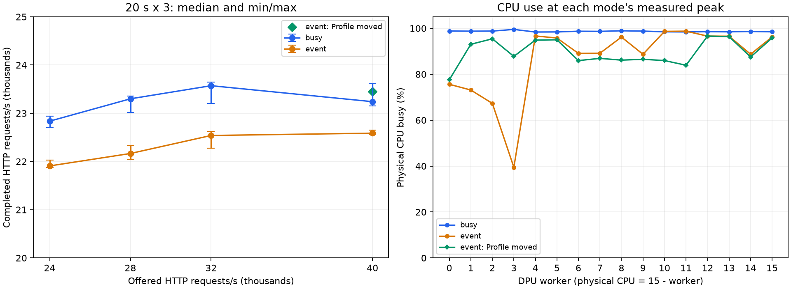

# DSB peak throughput 및 병목 — 2026-09-29

## 결과와 병목 판단

기본 배치의 peak 처리량은 **busy 23,572 HTTP req/s, event 22,587 HTTP req/s**다(20초×3회 중앙값). 같은 목표 부하의 60초 실행에서도 각각 **23,731 / 22,491 req/s**였다. Event는 peak 중앙값 기준 busy보다 4.18% 낮다.

1. **DPU worker별 L7 부하 편중이 성능을 제한한다.** Event에서 Profile+frontend가 함께 있는 worker 10/11의 물리 코어는 각각 98.7/98.8%지만, worker 3은 39.5%, worker 2는 67.3%였다. 포화 worker의 self cycles 약 45%는 HTTP/2·Linkerd proxy 처리다. `h2::frame::headers::HeaderBlock::into_encoding`, Linkerd stack future/connection polling 등이 hot path다.
2. **배치 변경으로 제한 요인을 검증했다.** Profile 0/1의 DPU owner만 worker 10/11→3/2로 이동하면 20초 중앙값이 23,452 req/s(+3.83%), 60초 처리량이 23,594 req/s(+4.91%)로 개선됐다. 기존 두 포화 코어는 84–86%로 내려갔다. 이 개입 결과는 편중이 병목의 일부임을 뒷받침한다. 단, 순차 실행이며 NodePort 연결 분포가 재생성되므로 개선폭 전체를 배치 하나의 정밀한 효과 크기로 단정하지 않는다.
3. **Host도 다음 확장의 제약이다.** 기본 peak에서 Host 전체 16코어 중 14.8–15.0코어(92.5–93.5%), 배치 변경 60초에서는 15.13코어(94.5%)를 사용했다. Host self CPU의 55–57%가 Go runtime이며 map/hash, allocator/GC, lock/scheduler가 포함된다. Geo 프로세스에서는 `runtime.mapaccess2`+`internal/runtime/maps.memHashAES`가 약 42%다. Native DPUMesh는 1.7–1.8%, DOCA/RDMA는 0.4% 수준이다. 현재 Host 비용의 주성분을 native polling으로 설명하기 어렵다. Host CPU 총량만으로 단일 lock/스레드 제약까지 확정할 수는 없다.
4. **Busy의 모든 코어가 100%에 가깝다는 사실은 유효 작업 포화를 뜻하지 않는다.** Busy는 idle에서도 15.77코어, event는 0.12코어다. Event의 worker 사용률과 profile, 위 배치 실험이 실제 부하 집중을 더 잘 보여준다.
5. **wrk/링크 대역폭은 주요 제한으로 보이지 않는다.** r4 wrk는 할당한 10코어 중 최대 약 1.71코어, ingress/egress는 52–81Mbps 수준으로 200Gbps 대비 작고 인터페이스 drop/error 증가도 없었다. 이 수치는 링크 대역폭을 배제하는 근거이지 내부 DMA credit/lock 제약을 모두 배제하는 근거는 아니다.

다음 최적화 순서는 (a) frontend와 Profile 등 고부하 endpoint의 worker 배치 균형, (b) Geo map/hash·직렬화와 Go allocation/스케줄링 비용, (c) 포화 DPU worker의 H2 header/Linkerd stack 비용이다. DMA ring 크기나 DPA thread 수가 이번 peak의 주병목이라는 증거는 얻지 못했다.

**지연시간 주의:** 위 값은 overload에서의 완료 처리량 상한이다. 60초 측정 p99는 busy 17.43초/event 28.82초/배치 변경 event 25.49초다. 요청률 32K 또는 40K를 감당한다거나 낮은 지연시간으로 23K를 지속 처리한다고 해석하면 안 된다. 지연시간 SLO 기준 capacity는 별도 부하 세분화가 필요하다.



## 측정 조건

- DPU 16 sharded workers, dpu-dma, frontend 8 replicas, Host 앱 29개/CPU 0–15/GOMAXPROCS=4. Frontend workers 14/15/12/13/10/11/5/4, Search 6–9. Replica/코드/바이너리는 직전 단일 wrk 실험과 동일하다.
- r4의 wrk 1 process, -t10 -c1000 -D exp -L, CPU 0–9. 10.8.8.2의 측정용 NodePort가 native DPUMesh frontend 8개로 TCP 연결을 분산한다. 기존 frontend Service/Pod를 사용하지 않았다.
- Busy→event 순서. 모드 사이 DB/cache 초기화. 24K/28K/32K/40K 각각 20초×3회. 3회 처리량 중앙값이 가장 높은 목표 부하를 선택해 60초 비계측 실행과 별도 45초 진단 실행, 20초 비계측 재확인을 했다. 12K warmup/recovery 각 20초.
- Peak는 이 구성/부하 범위에서 관측한 최대 완료 처리량이다. Overload에서 완료 처리량이 유지돼도 큐잉 지연은 증가하므로, 이를 지연시간 SLO를 만족하는 용량으로 해석하지 않는다. p99는 단일 wrk의 corrected histogram이다.
- Formal throughput 실행에는 perf를 사용하지 않았다. Diagnostic에만 DPU cycles 49Hz×30초, Host cpu-clock 99Hz×20초 및 frame-pointer call graph를 수집했다. 추가 INFO 로그는 켜지 않았다. 프로파일의 self 비율은 인과 효과 크기가 아니며, unresolved/인라인 함수의 한계가 있다.

## 부하 sweep (20초 × 3회 중앙값)

| 모드 | 목표 HTTP/s | 실제 HTTP/s | 반복 범위 | p99 ms | DPU proxy cores | Host 앱 cores | Host physical busy cores |
|---|---:|---:|---|---:|---:|---:|---:|
| busy | 24000 | 22837 | 22706–22937 | 2510 | 15.26 | 13.67 | 14.82 |
| busy | 28000 | 23300 | 23019–23355 | 5010 | 15.26 | 13.78 | 14.94 |
| busy | 32000 | 23572 | 23202–23646 | 6750 | 15.24 | 13.79 | 14.96 |
| busy | 40000 | 23241 | 23157–23619 | 9040 | 15.08 | 13.81 | 14.97 |
| event | 24000 | 21908 | 21877–22030 | 3670 | 13.16 | 13.44 | 14.60 |
| event | 28000 | 22166 | 22034–22338 | 5810 | 13.23 | 13.49 | 14.65 |
| event | 32000 | 22539 | 22278–22628 | 7090 | 13.09 | 13.54 | 14.72 |
| event | 40000 | 22587 | 22555–22647 | 9370 | 13.28 | 13.63 | 14.80 |

## Peak 검증과 계측 영향

| 모드 | 단계 | 목표 HTTP/s | 실제 HTTP/s | p99 ms | DPU proxy cores | Host physical cores |
|---|---|---:|---:|---:|---:|---:|
| busy | sustained | 32000 | 23731 | 17430 | 15.17 | 15.06 |
| busy | diagnostic | 32000 | 22993 | 15180 | 15.19 | 15.09 |
| busy | post-diagnostic | 32000 | 23224 | 6650 | 15.04 | 14.87 |
| event | sustained | 40000 | 22491 | 28820 | 13.18 | 14.81 |
| event | diagnostic | 40000 | 21932 | 21730 | 13.08 | 14.89 |
| event | post-diagnostic | 40000 | 22256 | 9980 | 13.25 | 14.72 |

## Peak 목표 부하에서 DPU 코어별 사용량

20초 peak 부하 3회 평균. CPU i에는 worker 15−i가 배치된다. Physical busy는 idle+iowait를 제외하며, worker CPU는 user+system 시간이다.

| CPU | Worker | 배치 프로세스 | Busy physical % | Busy worker % | Event physical % | Event worker % |
|---:|---:|---|---:|---:|---:|---:|
| 0 | 15 | reservation-0, frontend-1 | 98.48 | 93.93 | 96.25 | 94.43 |
| 1 | 14 | user-0, frontend-0 | 98.62 | 94.73 | 88.71 | 86.19 |
| 2 | 13 | recommendation-1, frontend-3 | 98.47 | 94.49 | 96.55 | 94.72 |
| 3 | 12 | recommendation-0, frontend-2 | 98.53 | 93.96 | 96.60 | 93.72 |
| 4 | 11 | profile-1, frontend-5 | 98.43 | 95.34 | 98.75 | 97.23 |
| 5 | 10 | profile-0, frontend-4 | 98.48 | 95.48 | 98.66 | 95.51 |
| 6 | 9 | search-3 | 98.78 | 95.05 | 88.69 | 85.95 |
| 7 | 8 | search-2 | 98.92 | 91.49 | 96.18 | 92.02 |
| 8 | 7 | search-1 | 98.67 | 95.82 | 89.15 | 86.64 |
| 9 | 6 | search-0 | 98.73 | 95.61 | 89.08 | 86.38 |
| 10 | 5 | rate-3, frontend-6 | 98.42 | 93.70 | 95.77 | 93.69 |
| 11 | 4 | rate-2, attractions-0, frontend-7 | 98.38 | 94.76 | 96.67 | 94.53 |
| 12 | 3 | rate-1, review-0 | 99.52 | 97.20 | 39.47 | 31.47 |
| 13 | 2 | rate-0, reservation-3 | 98.79 | 94.76 | 67.32 | 60.44 |
| 14 | 1 | geo-1, reservation-2 | 98.76 | 95.04 | 73.12 | 65.37 |
| 15 | 0 | geo-0, reservation-1 | 98.82 | 94.61 | 75.63 | 69.64 |

## DPU 진단 profile (worker별 self cycles)

| 모드 | Worker | HTTP/H2·proxy % | Driver/control % | Tokio % | Kernel % | Unresolved % |
|---|---:|---:|---:|---:|---:|---:|
| busy | 0 | 19.3 | 13.3 | 13.2 | 18.0 | 15.7 |
| busy | 1 | 17.5 | 15.6 | 12.4 | 17.9 | 16.1 |
| busy | 2 | 15.5 | 18.4 | 11.6 | 17.6 | 16.7 |
| busy | 3 | 6.9 | 23.1 | 9.5 | 22.0 | 21.0 |
| busy | 4 | 44.0 | 6.7 | 7.9 | 10.0 | 8.0 |
| busy | 5 | 39.3 | 9.0 | 9.3 | 9.4 | 10.3 |
| busy | 6 | 37.9 | 7.5 | 10.4 | 12.5 | 10.8 |
| busy | 7 | 38.3 | 7.2 | 10.6 | 11.6 | 9.1 |
| busy | 8 | 31.3 | 9.9 | 10.2 | 15.0 | 10.6 |
| busy | 9 | 39.1 | 7.3 | 9.9 | 11.9 | 9.0 |
| busy | 10 | 50.3 | 1.0 | 11.8 | 7.9 | 7.8 |
| busy | 11 | 46.8 | 1.6 | 9.0 | 9.1 | 8.0 |
| busy | 12 | 40.6 | 7.3 | 7.3 | 10.4 | 9.5 |
| busy | 13 | 43.7 | 5.9 | 8.9 | 7.6 | 10.2 |
| busy | 14 | 35.7 | 10.2 | 7.1 | 11.9 | 12.3 |
| busy | 15 | 42.9 | 6.1 | 8.5 | 9.4 | 8.4 |
| event | 0 | 29.7 | 3.3 | 14.0 | 19.6 | 13.7 |
| event | 1 | 28.6 | 2.9 | 12.5 | 19.2 | 13.4 |
| event | 2 | 26.3 | 4.2 | 15.1 | 20.7 | 10.7 |
| event | 3 | 26.2 | 4.0 | 12.7 | 18.1 | 12.7 |
| event | 4 | 46.9 | 2.0 | 8.9 | 9.3 | 9.8 |
| event | 5 | 48.1 | 2.2 | 7.7 | 10.2 | 7.6 |
| event | 6 | 42.8 | 1.5 | 10.5 | 12.4 | 8.4 |
| event | 7 | 42.7 | 2.0 | 10.5 | 13.6 | 7.7 |
| event | 8 | 45.1 | 1.3 | 10.6 | 9.8 | 7.1 |
| event | 9 | 45.6 | 1.7 | 10.4 | 13.3 | 6.3 |
| event | 10 | 45.4 | 0.8 | 10.6 | 8.5 | 9.5 |
| event | 11 | 44.6 | 0.8 | 11.0 | 8.8 | 8.3 |
| event | 12 | 42.5 | 2.2 | 9.4 | 9.8 | 9.6 |
| event | 13 | 46.1 | 1.1 | 10.2 | 8.9 | 8.3 |
| event | 14 | 44.2 | 1.7 | 7.0 | 13.0 | 7.9 |
| event | 15 | 45.5 | 1.9 | 8.8 | 8.6 | 9.5 |

HTTP/H2·proxy는 h2/http/Linkerd routing/stack 등의 resolved 함수 self cycles를 합산한 값이다. Driver/control에는 유효 DMA 처리도 포함되므로 모두 idle polling 비용이라고 해석하지 않는다.

## Host 진단 profile

| 모드 | 구분 | self CPU 비중 % |
|---|---|---:|
| busy | go_runtime | 56.73 |
| busy | other_application_libraries | 15.85 |
| busy | kernel | 13.33 |
| busy | unresolved | 1.35 |
| busy | grpc_h2 | 8.85 |
| busy | protobuf | 1.82 |
| busy | native_dpumesh | 1.69 |
| busy | doca_rdma | 0.37 |
| event | go_runtime | 55.45 |
| event | other_application_libraries | 15.98 |
| event | grpc_h2 | 9.24 |
| event | kernel | 13.94 |
| event | unresolved | 1.31 |
| event | doca_rdma | 0.43 |
| event | protobuf | 1.81 |
| event | native_dpumesh | 1.84 |

## Profile owner 배치 대조 실험 (event)

동일 바이너리/29개 Host 앱/replica 수/Host affinity를 유지하고 임시 topology의 Profile owner만 이동했다. 전체 부하 sweep을 다시 하지 않고, 40K offered에서 20초×3회와 60초를 검증했다. 따라서 이 결과를 새로운 전역 최적 배치 또는 새로운 전체 sweep 최대치라고 주장하지 않는다. Product 기본 배치는 변경하지 않았다.

| 배치 | 20초 중앙값 req/s | 반복 범위 | 60초 req/s | 60초 DPU proxy cores | 60초 Host physical cores |
|---|---:|---|---:|---:|---:|
| 기본 | 22587 | 22555–22647 | 22491 | 13.18 | 14.81 |
| Profile owner 이동 | 23452 | 23232–23522 | 23594 | 13.59 | 15.13 |

| Worker (CPU) | 기본 physical % | 이동 후 physical % |
|---|---:|---:|
| 10 (5) | 98.7 | 86.0 |
| 11 (4) | 98.8 | 83.9 |
| 3 (12) | 39.5 | 87.8 |
| 2 (13) | 67.3 | 95.4 |

이동 후 7개 trial 모두 외부 HTTP/socket 오류 없음. 내부 RPC error 합계 3건. DPA lifecycle {'contexts': 1, 'pool_assign': 115, 'pool_release': 115}. Host 앱 29개와 proxy 모두 정상 종료했다.

## NodePort 연결 검증

60초 실행 중 wrk가 실제 1 process인지 확인했다. OS thread 수는 main 포함 11이며 `-t10` worker 설정이다. 각 모드의 TCP 연결 1,000개가 frontend 8개에 아래와 같이 분산됐다. 개별 HTTP 요청을 재분배하는 방식이 아니라 연결 단위 분산이다.

| 모드 | frontend 0→7 연결 수 | 합계 |
|---|---|---:|
| busy | 132, 134, 127, 132, 125, 110, 116, 124 | 1000 |
| event | 121, 117, 114, 153, 114, 134, 122, 125 | 1000 |

20초 sweep의 실제 command 형식:

```bash
taskset -c 0-9 /tmp/dsb-regression-20260929/wrk -D exp -t10 -c1000 -d20s -L \
  -s /tmp/dsb-peak-20260929/<busy|event>/<trial>/nodeport.lua \
  http://10.8.8.2:32713 -R <24000|28000|32000|40000>
```

Lua는 mixed-workload_type_1의 base URL만 이 NodePort로 바꿨다. 배치 대조 실험은 별도 임시 NodePort 30969를 사용했다. 두 Service와 EndpointSlice는 종료 후 삭제했으므로 위 포트는 현재 열려 있지 않다.

내부 RPC error는 일부 warmup/24K/28K/recovery에서 관측됐으며 아래에 모두 기재했다. 32K/40K peak 및 60초 단계에는 없었다. 외부 HTTP 2xx만으로 모든 내부 RPC가 성공했다고 해석하지 않는다. 계수만으로 cancellation/오류 원인을 분류할 수는 없다.

## 부하 발생기 / 네트워크 / 오류

- busy: peak trial r4 wrk CPU 최대 1.51/10 cores; Host ens4f0 평균 RX 52.1Mbps / TX 80.3Mbps. 링크는 200Gbps다.
- busy: idle proxy CPU 15.77 cores. 전체 trial HTTP/socket success=True; DPA lifecycle {"contexts": 1, "pool_assign": 115, "pool_release": 115}.
- busy/r24000-1: client errors=[{"non2xx": 0, "socket_errors": {}, "exit": 0}]; internal RPC errors=229.
- busy/r24000-2: client errors=[{"non2xx": 0, "socket_errors": {}, "exit": 0}]; internal RPC errors=384.
- busy/r24000-3: client errors=[{"non2xx": 0, "socket_errors": {}, "exit": 0}]; internal RPC errors=188.
- busy/r28000-1: client errors=[{"non2xx": 0, "socket_errors": {}, "exit": 0}]; internal RPC errors=7.
- busy/r28000-2: client errors=[{"non2xx": 0, "socket_errors": {}, "exit": 0}]; internal RPC errors=1.
- busy/r28000-3: client errors=[{"non2xx": 0, "socket_errors": {}, "exit": 0}]; internal RPC errors=4.
- event: peak trial r4 wrk CPU 최대 1.71/10 cores; Host ens4f0 평균 RX 62.6Mbps / TX 77.6Mbps. 링크는 200Gbps다.
- event: idle proxy CPU 0.12 cores. 전체 trial HTTP/socket success=True; DPA lifecycle {"contexts": 1, "pool_assign": 115, "pool_release": 115}.
- event/warmup: client errors=[{"non2xx": 0, "socket_errors": {}, "exit": 0}]; internal RPC errors=1.
- event/r24000-1: client errors=[{"non2xx": 0, "socket_errors": {}, "exit": 0}]; internal RPC errors=76.
- event/r24000-2: client errors=[{"non2xx": 0, "socket_errors": {}, "exit": 0}]; internal RPC errors=89.
- event/r24000-3: client errors=[{"non2xx": 0, "socket_errors": {}, "exit": 0}]; internal RPC errors=80.
- event/r28000-1: client errors=[{"non2xx": 0, "socket_errors": {}, "exit": 0}]; internal RPC errors=2.
- event/r28000-2: client errors=[{"non2xx": 0, "socket_errors": {}, "exit": 0}]; internal RPC errors=1.
- event/r28000-3: client errors=[{"non2xx": 0, "socket_errors": {}, "exit": 0}]; internal RPC errors=1.
- event/recovery: client errors=[{"non2xx": 0, "socket_errors": {}, "exit": 0}]; internal RPC errors=1.
- CPU 총량만으로 단일 스레드/lock/credit 제약을 배제할 수 없다. 함수별 profile과 worker 편중을 함께 보고 병목 후보와 확정된 관측을 구분한다.
- 실험 프로세스, Compose, 측정용 Service/EndpointSlice와 추가한 임시 IP를 정리했다. 기존 서비스 및 OVS/EU/SF/sysctl 설정은 변경하지 않았다. 모든 실행은 scoped PID birth/UID 확인으로 정리했다.

## 원본 자료

2026-09-29_dsb-peak-throughput-bottleneck-raw.tar.gz

SHA-256: `4bc74b923de1c999045928a4444a562f992d544925122248a655e83bb0061a4e`
