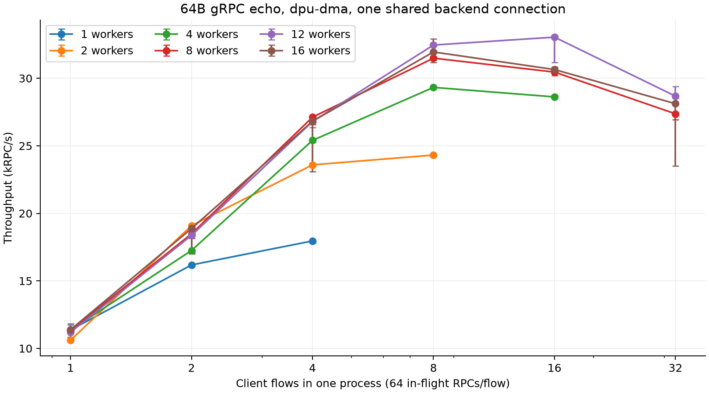
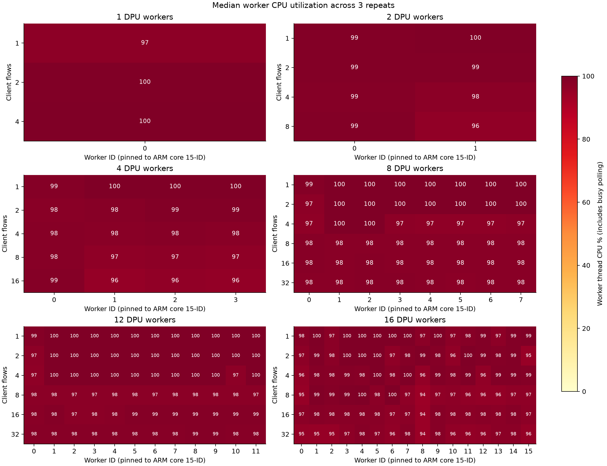

# 단일 gRPC-go process: flow 수 × DPU worker 수 성능 측정

2026-09-30 UTC. **PASS, 30개 조건 × 3회 = 90회 유효 실행.** 최고 중앙값은 **33,044.2 RPC/s** (worker 12개, client flow 16개). 측정 구간에서 총 **20,257,913개**의 64B echo 응답을 검증했다.

## 조건

- Host client process **1개**, server process **1개**. Client process 안에서 서로 다른 gRPC ClientConn/native flow를 생성했다. 모든 flow는 한 channel/Comch session을 공유하고 `DPUMesh0`에 연결한다.
- Flow당 concurrent RPC **64개**. 총 in-flight는 `64 × client flows`이며 32 flows에서는 2,048개다. Payload는 application request/response 각각 64B인 unary raw-codec echo다.
- DPU `dpu-dma`, sharded + busy-poll, `least-flows`. Worker 수 1/2/4/8/12/16, worker i는 ARM CPU `15-i`에 pin. Dispatcher는 control path만 담당한다.
- Backend replica의 **active backend connection은 하나**다. `DPUMESH_BACKEND_POOL=1`, `DPUMESH_BACKEND_MAX=1`이며 backend owner는 각 proxy 실행의 worker 0이었다.
- Client flow 수는 1/2/4/8/16/32 중 **worker당 최대 4개**를 넘지 않는 조건만 집계했다. Backend flow 하나는 별도다. 단일 channel의 32-flow 한도로 12/16-worker에서 48/64 client flows는 실행하지 않았다.
- Host jet1의 client는 CPU0–7, server는 CPU8–15를 사용하고 각각 `GOMAXPROCS=8`. Host PCI 0b:00.1, DPU PCI 03:00.1. NIC/SF/EU 설정 변경 없음.
- 각 실행 warmup 3초 + measurement 10초, 3회 반복. Release 최적화 빌드(LTO, opt-level 3), native transport는 debugoptimized(-O2). 빌드 완료 후 측정을 시작했다.

## Throughput

단위: **kRPC/s**, 3회 중앙값. `—`는 worker당 최대 4 client flows 조건을 벗어나 측정 대상에서 제외한 조합이다.

| DPU workers / client flows | 1 | 2 | 4 | 8 | 16 | 32 |
|---:|---:|---:|---:|---:|---:|---:|
| 1 | 11.36 | 16.18 | 17.96 | — | — | — |
| 2 | 10.61 | 19.09 | 23.59 | 24.31 | — | — |
| 4 | 11.35 | 17.25 | 25.40 | 29.32 | 28.62 | — |
| 8 | 11.34 | 18.48 | 27.12 | 31.49 | 30.46 | 27.37 |
| 12 | 11.20 | 18.37 | 26.80 | 32.46 | 33.04 | 28.68 |
| 16 | 11.38 | 18.88 | 26.82 | 31.95 | 30.65 | 28.12 |



최고 조건의 반복 범위는 31,173.6–33,192.3 RPC/s, p99 latency 중앙값은 37.64 ms였다. 이 실험은 flow당 동시 RPC를 고정했으므로 flow 수와 총 동시 RPC 수가 함께 증가한다.

16-worker/32-flow는 **23,521.2–28,581.6 RPC/s**로 변동이 컸고 중앙값은 **28,116.2 RPC/s**였다. 최저 실행에서 worker 0 CPU는 81.7%, 해당 ARM core 전체 busy는 97.6%였다. Worker 외 실행 시간의 영향 가능성이 있으나 당시 다른 process별 profiler는 수집하지 않아 원인은 미확정이다. 이 실행도 제외하지 않고 3회 통계에 포함했다.

## DPU worker별 CPU

각 실행의 10초 측정 구간에 `/proc/<proxy>/task/<tid>/stat`의 user+system CPU time 차이를 사용했다. 아래 값은 그 평균 CPU 사용률의 3회 중앙값이며 **100%=ARM core 하나**다. Worker와 이름을 공유하는 SDK helper thread는 TID로 분리해 별도 저장했다. Dispatcher, 전체 proxy 및 core busy%는 결과 JSON에 있고, 원본 CPU snapshot은 raw archive의 각 `*-cpu.json`에 있다. CPU marker는 Host가 출력한 measurement start/end를 SSH로 수신하여 채취하며 실제 표본 간격도 기록했다. Jiffy 단위 계수와 표본 시점 때문에 100%를 소폭 넘는 값이 생길 수 있다.

**Busy-poll 비용이 포함되므로 CPU≈100%가 유효 RPC 연산의 포화를 의미하지 않는다.** Flow가 배정되지 않은 worker도 약 100%를 사용했다. 3회 실행 사이 placement cursor가 이어지므로 일부 소수-flow 조건에서는 active worker가 달라진다. 각 실행의 flow→worker 배정도 JSON에 보존했다.



### 1 workers

| Client flows | W0 |
|---:|---:|
| 1 | 97.2% |
| 2 | 99.6% |
| 4 | 99.7% |

### 2 workers

| Client flows | W0 | W1 |
|---:|---:|---:|
| 1 | 99.0% | 99.6% |
| 2 | 99.0% | 99.0% |
| 4 | 98.7% | 97.6% |
| 8 | 98.9% | 96.2% |

### 4 workers

| Client flows | W0 | W1 | W2 | W3 |
|---:|---:|---:|---:|---:|
| 1 | 98.5% | 100.0% | 100.0% | 99.9% |
| 2 | 97.8% | 98.3% | 99.0% | 99.0% |
| 4 | 98.3% | 98.0% | 98.1% | 98.0% |
| 8 | 98.4% | 96.8% | 96.9% | 96.8% |
| 16 | 98.6% | 95.6% | 96.2% | 96.0% |

### 8 workers

| Client flows | W0 | W1 | W2 | W3 | W4 | W5 | W6 | W7 |
|---:|---:|---:|---:|---:|---:|---:|---:|---:|
| 1 | 98.5% | 99.9% | 100.0% | 100.0% | 100.0% | 100.0% | 100.0% | 100.0% |
| 2 | 97.1% | 99.9% | 100.0% | 99.9% | 99.9% | 100.0% | 100.0% | 100.0% |
| 4 | 96.8% | 100.0% | 99.9% | 97.1% | 96.7% | 96.6% | 96.8% | 97.2% |
| 8 | 98.2% | 97.8% | 97.9% | 97.8% | 97.8% | 97.7% | 97.8% | 97.8% |
| 16 | 98.4% | 97.8% | 98.1% | 98.0% | 97.9% | 97.9% | 97.9% | 98.0% |
| 32 | 98.0% | 97.9% | 98.1% | 98.1% | 98.0% | 97.6% | 98.0% | 97.9% |

### 12 workers

| Client flows | W0 | W1 | W2 | W3 | W4 | W5 | W6 | W7 | W8 | W9 | W10 | W11 |
|---:|---:|---:|---:|---:|---:|---:|---:|---:|---:|---:|---:|---:|
| 1 | 98.8% | 99.8% | 99.9% | 100.0% | 100.0% | 100.0% | 100.0% | 99.8% | 99.9% | 100.0% | 100.0% | 100.1% |
| 2 | 97.1% | 100.0% | 100.0% | 100.0% | 99.9% | 99.9% | 100.0% | 100.0% | 100.0% | 100.0% | 100.0% | 100.0% |
| 4 | 96.8% | 99.9% | 99.9% | 100.0% | 99.9% | 100.0% | 100.0% | 99.8% | 99.9% | 100.0% | 96.9% | 99.9% |
| 8 | 97.5% | 97.5% | 97.4% | 97.4% | 97.6% | 97.6% | 97.4% | 97.5% | 97.6% | 97.5% | 97.6% | 97.3% |
| 16 | 98.0% | 98.5% | 97.5% | 97.6% | 97.8% | 98.8% | 98.5% | 98.7% | 98.8% | 98.8% | 98.7% | 98.6% |
| 32 | 98.3% | 98.2% | 98.2% | 98.1% | 98.4% | 98.4% | 98.3% | 98.3% | 98.5% | 98.6% | 98.1% | 98.4% |

### 16 workers

| Client flows | W0 | W1 | W2 | W3 | W4 | W5 | W6 | W7 | W8 | W9 | W10 | W11 | W12 | W13 | W14 | W15 |
|---:|---:|---:|---:|---:|---:|---:|---:|---:|---:|---:|---:|---:|---:|---:|---:|---:|
| 1 | 98.2% | 99.8% | 97.4% | 99.9% | 99.7% | 100.0% | 99.9% | 99.7% | 97.5% | 99.9% | 97.5% | 98.3% | 99.0% | 97.1% | 99.0% | 99.3% |
| 2 | 97.0% | 99.4% | 97.6% | 99.8% | 99.9% | 99.9% | 96.8% | 98.5% | 99.3% | 98.5% | 96.3% | 99.7% | 99.0% | 98.5% | 99.2% | 94.6% |
| 4 | 96.1% | 98.5% | 98.4% | 98.8% | 98.4% | 99.8% | 97.8% | 99.7% | 95.8% | 98.9% | 98.4% | 99.3% | 96.4% | 99.1% | 99.1% | 98.5% |
| 8 | 95.0% | 99.3% | 98.8% | 99.4% | 99.9% | 97.6% | 99.7% | 96.7% | 94.0% | 96.7% | 97.0% | 96.4% | 96.0% | 96.1% | 96.7% | 96.7% |
| 16 | 97.3% | 98.2% | 97.8% | 98.0% | 97.9% | 98.0% | 96.7% | 97.5% | 94.3% | 98.3% | 97.6% | 97.6% | 97.7% | 97.6% | 98.2% | 97.1% |
| 32 | 95.4% | 95.1% | 95.1% | 97.0% | 98.4% | 97.4% | 96.4% | 98.4% | 94.3% | 98.1% | 96.4% | 95.8% | 96.2% | 97.3% | 97.6% | 95.5% |

## Host CPU 및 해석

| DPU workers | 해당 worker 수의 최고 throughput 조건 (flows) | kRPC/s | Host client CPU | Host server CPU | Dispatcher CPU |
|---:|---:|---:|---:|---:|---:|
| 1 | 4 | 17.96 | 81.5% | 94.6% | 0.40% |
| 2 | 8 | 24.31 | 109.4% | 138.6% | 0.40% |
| 4 | 8 | 29.32 | 126.8% | 166.1% | 0.60% |
| 8 | 8 | 31.49 | 138.1% | 170.5% | 0.70% |
| 12 | 16 | 33.04 | 152.9% | 184.7% | 1.00% |
| 16 | 8 | 31.95 | 137.7% | 177.8% | 1.10% |

Host CPU 역시 100%=logical CPU 하나다. Client CPU는 benchmark 내부 getrusage, server CPU는 measurement marker 수신 시 `/proc/<pid>/stat`으로 측정했다. Host의 전체 8-core pool이 포화된 수치는 아니지만, 이 집계만으로 Go poller/native lock 등 직렬 경로의 병목을 배제할 수는 없다.

현재 설정에서 worker 증가에 비례하는 선형 throughput 증가는 관찰되지 않았다. Backend H2 하나와 해당 owner worker, Host process의 공유 transport 경로가 남아 있다. 이번에는 profiler로 병목 위치를 분리하지 않았으므로 특정 함수가 원인이라고 단정하지 않는다.

## 검증·종료·집계 제외

- 유효 실행 90회 모두 `ok=true`, RPC 오류 0, 재연결 0. 모든 flow의 native dial은 정확히 1회이고 각 응답의 64B 전체를 비교했다. Measurement 밖 warmup/drain까지 포함한 성공 완료는 26,375,437개이며 preflight는 별도다.
- Dispatcher 로그에서 한 client session의 flow 분산과 worker당 client flow 최대 4개를 확인했다. Backend는 proxy 실행마다 한 flow를 유지했다.
- 범위 변경 요청 전에 완료된 1-worker의 8/16/31-flow 결과는 최종 집계에서 제외했다. 설정 전환을 위해 2-worker/2-flow의 진행 중 실행 하나를 SIGTERM으로 정상 정리한 뒤 재측정했다. 해당 취소 실행은 성능/오류 통계에 포함하지 않았고 원본은 `w2-before-cap`에 보관했다. 2-worker/1-flow의 완료된 3회는 그대로 유지했다.
- 범위 변경 전 실행과 취소 실행을 포함한 전체 raw run의 DPA flow assign/release는 **900/900**로 일치한다. 모든 server/proxy 정상 종료, 각 proxy 종료 후 DPU DPA processes=0. Mock은 해당 실행 PID/시작 시각/executable을 확인한 뒤 SIGTERM으로 종료했다.
- DOCA ERR, DPA fatal, proxy panic 없음. SDK alignment/empty DPA ops 등의 기존 경고는 있었다.

## 재현 자료

DPU와 Host 원본 경로: `/tmp/dmesh-flow-scale-20260930`. `host.py`, `suite.py`, worker별 proxy/Host 로그, PID 기록, CPU snapshots, release build 로그를 보관했다. Go harness는 `integrations/grpc/go/cmd/channel-bench`의 실험용 복사본에서 입력 제한만 32로 확장했다. 제품 코드는 변경하지 않았다.

Host 공통 환경:

```sh
export DPUMESH_PCI_ADDR=0b:00.1 DPUMESH_SERVER=DPUMesh0
export DPUMESH_SERVICE_IP=10.0.1.1 DPUMESH_SERVICE_PORT=8086
export DPUMESH_REVERSE=dpu-dma GOMAXPROCS=8
export DPUMESH_CONFIG=/tmp/dmesh-flow-scale-20260930/registry
export LD_LIBRARY_PATH=/tmp/dmesh-grpc-go-commit-20260930/build/lib:/opt/mellanox/doca/lib/x86_64-linux-gnu:/opt/mellanox/flexio/lib
# Registry: 10.0.1.1:8086 bench-echo 2
# Server adds SERVICE=10.0.1.1:8086, POD_IP=10.99.1.2, BACKEND_POOL=1, BACKEND_MAX=1 (DPUMESH_ prefix)
export DPUMESH_POD_IP=10.99.1.3 DPUMESH_WORKLOAD=flow-scale-client
F=16 # client flow count
taskset -c 0-7 /tmp/dmesh-flow-scale-20260930/channel-bench -mode client -connections "$F" -concurrency "$((64*F))" \
  -warmup 3s -duration 10s -rpc-timeout 10s -timeout 90s
```

DPU launcher: `integrations/deathstarbench/proxy-start.sh <workers> <output-directory>`. Default sharded/busy/least-flows, 1 backend endpoint를 mock echo routing으로 연결했다.

SHA-256:

```text
3dfe6c4cb8d0d1ce0a7131f6e53a70c93686d1ce91b4d56dd38eb9734eb7fecc  /home/youngmin/DPUMesh/linkerd2-proxy/target/release/linkerd2-proxy
24437539552e9e28f6d15015bcf5133a936edc2d483d9df45e38d9564277c157  /tmp/dmesh-flow-scale-20260930/channel-bench
164bc7167087c5129c36077e26ca455b39b53c72584c67af098a3cc8c67fdbcf  /tmp/dmesh-grpc-go-commit-20260930/build/lib/libdpumesh.so.5
```

[전체 JSON](2026-09-30_grpc-go-single-process-flow-scaling.json), [조건별 CSV](2026-09-30_grpc-go-single-process-flow-scaling.csv), [worker별 CPU CSV](2026-09-30_grpc-go-single-process-flow-scaling-worker-cpu.csv). Dirty source tree에서 빌드했으며 commit만으로 소스를 식별하지 않는다. 주요 소스 hash와 base commit은 JSON의 source_manifest에 있다.

[Raw archive](2026-09-30_grpc-go-single-process-flow-scaling-raw.tar.gz) (Git 제외),
SHA-256: `ead8ebf9a76bbbf1b14c85d08bea349c0141bba736ab595df66c78b4c7d9b238`.
