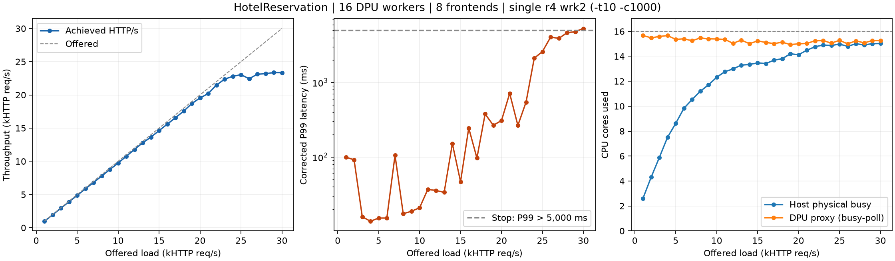

# HotelReservation: 최신 flow dispatcher 구현 최대 처리량 재측정

2026-10-01 UTC. 현재 DPUMesh native/Go API + per-flow dispatcher, DPU-dma, sharded busy-poll. HTTP req/s와 gRPC RPC/s는 서로 다른 지표다.

Ramp 중 최대 완료 처리량은 **23,360.23 HTTP req/s** (offered 29,000, P99 4,810.00ms). P99 5초 이하에서 가장 높은 관측값은 23,360.23 req/s (offered 29,000, P99 4,810.00ms)다.

선택 부하 29,000 req/s의 3회 측정 중앙값은 **23,357.72 req/s**, 범위 22,907.45–23,360.23, P99 중앙값 4,810.00ms다. Offered 30,000에서 P99 5,300.00ms로 5초를 초과해 더 높은 부하는 실행하지 않았다.

## 조건과 범위

- DSB `hotelres-bench-patches` baseline `312855ac450bcd35550a482517fd47e093a26ac4`에 기존 HotelReservation 포팅 패치와 현재 Go adapter를 사용했다. Host용 앱을 새로 빌드했다. `go test ./dmesh ./dialer ./services/geo` 통과.
- Host jet1에서 native Go process 29개: frontend 8, search/rate/reservation 각각 4, geo/profile/recommendation 각각 2, user/review/attractions 각각 1. CPU0–15 공유, process별 GOMAXPROCS=4. DB/cache/Consul/Jaeger는 별도 임시 Compose project이며 기존 클러스터 workload는 수정하지 않았다.
- DPU 16 workers, worker i는 CPU15−i, sharded/busy-poll, least-flows. Replica당 active backend connection 하나 (`DPUMESH_BACKEND_POOL=1`, `DPUMESH_BACKEND_MAX=1`). DPA context는 proxy process 안에서 공유한다. 최신 proxy/native binary는 직전 gRPC-go 실험과 동일하다.
- Comch 접속점은 DSB manifest와 일치하는 기존 DPUMesh<i> 설정을 유지했다. 이 값이 실제 data-path worker를 고정하는 것은 아니다. 실제 flow owner는 dispatcher가 결정하며 `placement.json`에 기록했다. 각 Host process는 제품 API의 channel/EQ 하나를 사용한다. 직전 64-flow echo용 multi-channel 실험 패치는 사용하지 않았다.
- r4에서 wrk **한 process**, `-D exp -t10 -c1000 -d20s -L`, CPU0–9. 목적지는 `10.8.8.2:30493`의 임시 NodePort이며 frontend 15000–15007로 TCP connection 단위 분산한다. Mixed-workload_type_1 Lua의 base URL만 바꿨다.
- Idle 20초 후 offered 1K부터 1K씩 올렸다. 각 단계 20초, 단계 사이 3초 + 계측 준비 시간. P99>5000ms에서 상승 중단 후, 그 이하에서 최대 처리량을 낸 부하를 추가 2회 확인한다. 반복에서 P99>5000ms이면 반복도 중단한다. 최고 처리량은 이 구성/측정 시간/지연 제한 안에서 관측한 값이며, 모든 부하·배치에 대한 전역 최대나 장시간 SLO 보장이 아니다.
- Formal throughput 측정에 perf는 사용하지 않았다. Host와 DPU /proc CPU, r4 CPU, 내부 RPC 계수 및 HTTP/socket 오류를 별도로 기록했다. CPU100%=core 하나. Busy-poll CPU에는 idle polling이 포함된다.



## Ramp 결과

| Offered req/s | 실제 req/s | P99 ms | Host physical cores | DPU proxy cores | HTTP 오류 | Socket 오류 | 내부 RPC 오류 |
|---:|---:|---:|---:|---:|---:|---:|---:|
| 1000 | 974.45 | 99.52 | 2.61 | 15.67 | 0 | 1248 | 0 |
| 2000 | 1945.29 | 91.65 | 4.31 | 15.48 | 0 | 211 | 0 |
| 3000 | 2931.39 | 15.77 | 5.89 | 15.59 | 0 | 36 | 0 |
| 4000 | 3911.93 | 13.73 | 7.51 | 15.66 | 0 | 13 | 0 |
| 5000 | 4865.66 | 15.16 | 8.62 | 15.36 | 0 | 6 | 0 |
| 6000 | 5869.00 | 15.17 | 9.83 | 15.40 | 0 | 1 | 0 |
| 7000 | 6810.77 | 105.60 | 10.53 | 15.25 | 0 | 0 | 0 |
| 8000 | 7794.40 | 17.33 | 11.20 | 15.47 | 0 | 0 | 1 |
| 9000 | 8770.38 | 18.70 | 11.71 | 15.40 | 0 | 0 | 1 |
| 10000 | 9740.86 | 20.82 | 12.32 | 15.39 | 0 | 0 | 0 |
| 11000 | 10757.24 | 36.77 | 12.77 | 15.35 | 0 | 0 | 0 |
| 12000 | 11790.10 | 35.55 | 12.98 | 15.04 | 0 | 0 | 1 |
| 13000 | 12791.04 | 33.57 | 13.30 | 15.30 | 0 | 0 | 11 |
| 14000 | 13635.87 | 151.29 | 13.34 | 15.01 | 0 | 0 | 0 |
| 15000 | 14622.12 | 46.65 | 13.47 | 15.24 | 0 | 0 | 2 |
| 16000 | 15596.06 | 244.74 | 13.42 | 15.11 | 0 | 0 | 1 |
| 17000 | 16564.55 | 96.64 | 13.69 | 15.02 | 0 | 0 | 282 |
| 18000 | 17550.82 | 377.86 | 13.80 | 15.12 | 0 | 0 | 6 |
| 19000 | 18701.11 | 266.75 | 14.20 | 14.94 | 0 | 0 | 14 |
| 20000 | 19543.78 | 307.97 | 14.12 | 15.00 | 0 | 0 | 123 |
| 21000 | 20194.07 | 714.24 | 14.48 | 15.03 | 0 | 0 | 218 |
| 22000 | 21470.51 | 265.21 | 14.76 | 15.24 | 0 | 0 | 178 |
| 23000 | 22369.71 | 545.28 | 14.90 | 15.26 | 0 | 0 | 342 |
| 24000 | 22798.86 | 2120.00 | 14.86 | 15.06 | 0 | 0 | 164 |
| 25000 | 23046.08 | 2600.00 | 14.98 | 15.28 | 0 | 0 | 139 |
| 26000 | 22436.10 | 4060.00 | 14.79 | 14.99 | 0 | 0 | 18 |
| 27000 | 23121.51 | 3910.00 | 15.01 | 15.24 | 0 | 0 | 10 |
| 28000 | 23192.43 | 4640.00 | 14.91 | 15.08 | 0 | 0 | 0 |
| 29000 | 23360.23 | 4810.00 | 15.01 | 15.25 | 0 | 0 | 0 |
| 30000 | 23353.68 | 5300.00 | 15.02 | 15.26 | 0 | 0 | 1 |

## 상한 부근 반복

| Trial | Offered req/s | 실제 req/s | P99 ms | HTTP/socket 정상 | 내부 RPC 오류 |
|---|---:|---:|---:|---|---:|
| r29000 | 29000 | 23360.23 | 4810.00 | True | 0 |
| confirm-r29000-2 | 29000 | 23357.72 | 4790.00 | True | 0 |
| confirm-r29000-3 | 29000 | 22907.45 | 4980.00 | True | 3 |

## 최대 관측 단계의 CPU와 flow 배정

아래는 r29000의 CPU 시간 평균이다. DPU proxy 15.25 cores, DPU physical busy 15.79/16 cores. Host 앱 13.86 cores, infrastructure 0.78 cores, Host physical busy 15.01/16 cores. r4 wrk 1.44/10 cores.

| Worker | ARM CPU | Worker CPU % | Physical busy % | Backend replicas |
|---:|---:|---:|---:|---|
| 0 | 15 | 95.36 | 98.47 | hotel-geo-0 |
| 1 | 14 | 95.42 | 98.89 | hotel-geo-1, hotel-profile-0 |
| 2 | 13 | 95.47 | 98.20 | hotel-rate-0 |
| 3 | 12 | 94.85 | 98.83 | hotel-rate-1, hotel-profile-1 |
| 4 | 11 | 93.92 | 98.52 | hotel-rate-2, hotel-recommendation-0 |
| 5 | 10 | 95.21 | 98.99 | hotel-rate-3, hotel-recommendation-1 |
| 6 | 9 | 95.47 | 98.68 | hotel-search-0, hotel-user-0 |
| 7 | 8 | 95.36 | 98.62 | hotel-reservation-0 |
| 8 | 7 | 96.65 | 98.89 | hotel-reservation-1 |
| 9 | 6 | 95.78 | 98.88 | hotel-search-1, hotel-reservation-2 |
| 10 | 5 | 94.44 | 98.15 | hotel-reservation-3 |
| 11 | 4 | 95.88 | 98.74 | hotel-review-0 |
| 12 | 3 | 92.06 | 99.05 | hotel-search-2, hotel-attractions-0 |
| 13 | 2 | 96.34 | 98.84 |  |
| 14 | 1 | 95.72 | 98.63 | hotel-search-3 |
| 15 | 0 | 95.88 | 98.95 |  |

동일한 이름을 상속한 SDK helper와 실제 worker는 TID로 구분했다.

## 검증·오류·정리

- 모든 서비스 health RPC, user login, frontend별 HTTP 경로, 64 concurrent searches를 검증했다. 응답은 기존 TCP baseline과 일치했다. Replica RPC counters는 HTTP 성공과 별도로 확인한다. HTTP 2xx만으로 내부 RPC 무오류를 주장하지 않는다.
- 측정 중 내부 RPC error 합계 1515건. 개별 단계와 전체 원본은 JSON에 있다. Error 종류를 stack profile 없이 단정하지 않았다. 저부하에서도 wrk socket timeout은 그대로 기록했다.
- DPA lifecycle: `{'contexts': 1, 'pool_assign': 98, 'pool_release': 98}`. Host 앱 종료, proxy scoped cleanup, DPA processes=0, 임시 Compose/Service/EndpointSlice/IP 삭제를 확인했다. 기존 frontend Service는 변경 전후 UID/spec가 동일하다.
- 첫 번째 시도는 실험용 Comch 접속점을 모두 DPUMesh0으로 덮어써 DSB manifest 검사를 통과하지 못했다. 부하를 시작하기 전에 중단했고 이 시도의 성능 데이터는 없다. 실패 로그와 cleanup 기록은 별도 원본에 보관했다. 재시도에서는 기존 접속점 설정을 유지했다.

## 실행 명령과 원본

```bash
taskset -c 0-9 /tmp/dsb-regression-20260929/wrk -D exp -t10 -c1000 -d20s -L \
  -s /tmp/dsb-current-peak-20261001-r2/busy/r<LOAD>/nodeport.lua \
  http://10.8.8.2:30493 -R <LOAD>
```

[CSV](2026-10-01_dsb-hotelreservation-current-peak.csv), [JSON](2026-10-01_dsb-hotelreservation-current-peak.json), [worker CPU CSV](2026-10-01_dsb-hotelreservation-current-peak-worker-cpu.csv).

DPU raw root `/tmp/dsb-current-peak-20261001-r2`. Host app source `/tmp/dsb-current-peak-20261001/hotel`. Source/binary SHA-256, topology, commands, raw wrk output, CPU snapshots 및 lifecycle 기록을 archive에 보존했다. NodePort는 정리했으므로 위 포트는 현재 실험 endpoint가 아니다.

## 해석 및 이전 결과와 비교

이번 구성의 20초 완료 처리량 상한은 약 **23.4K HTTP req/s**로, [이전 busy-poll ramp](2026-09-29_dsb-busy-load-ramp.md)의 약 23.5K와 비슷하다. 최신 per-flow dispatcher가 적용됐지만 DSB 전체 처리량이 큰 폭으로 증가한 결과는 아니다. gRPC 64B echo의 RPC/s와 이 HTTP mixed-workload의 req/s는 요청당 서비스 호출 수와 애플리케이션/DB 작업이 달라 직접 비교할 수 없다.

29K offered 반복 3회의 CPU 중앙값은 Host physical **14.99/16 cores**, Host 앱 **13.84 cores**, infrastructure **0.78 cores**, DPU proxy **15.25 cores**, r4 wrk **1.44/10 cores**다. DPU worker별 CPU 중앙값은 **92.03–96.55%**다. Host CPU 여유가 작고 load generator에는 여유가 있다. DPU busy-poll CPU가 높다는 사실만으로 모든 worker가 유효 RPC 처리로 포화됐다고 확정할 수는 없다. 이번에는 함수별 profiling이나 병목 제거 대조 실험을 하지 않았다.

32개 부하 실행 전체를 무오류라고 주장하지 않는다. 상한 확인 3회에서 외부 HTTP/socket 오류는 모두 0이지만, 마지막 반복의 내부 server RPC error counter가 3 증가했다. Ramp 최고점인 r29000과 두 번째 확인에서는 내부 RPC 오류도 0이었다. HTTP 응답만으로 내부 경로의 모든 호출 성공을 보장할 수 없다.

29K offered를 지속적으로 감당한다는 뜻도 아니다. 실제 완료는 약 23.4K이며 20초 안에도 P99가 약 4.8초까지 증가했다. 더 낮은 지연의 예로 r23000은 **22,369.71 req/s, P99 545.28ms**였다. 이 역시 단일 20초 관측이며 장시간 SLO 용량 검증은 아니다.

측정 구간에는 애플리케이션 flow 85개(backend 21개)가 유지됐다. 모든 측정이 끝난 뒤 shutdown 중 search backend 4개가 교체 생성되어 전체 DPA 할당/회수 기록은 **98/98**이었다(85 application + 9 readiness probes + 4 shutdown replacements). 이 4개는 성능 구간과 배치 통계에서 제외했다.

[Raw archive](2026-10-01_dsb-hotelreservation-current-peak-raw.tar.gz), SHA-256: `20a02127a5409d96677d23778813de4115871079a1b6dc63600c5c33b21bd9aa`.
