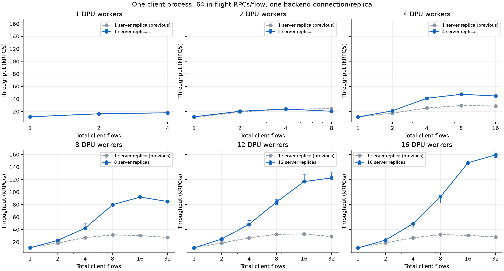
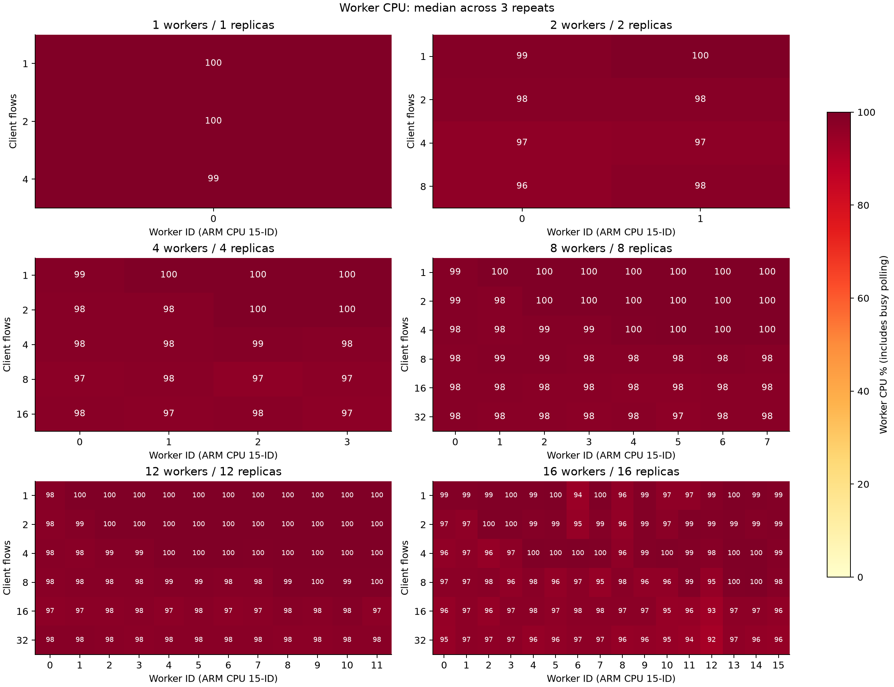

# 단일 gRPC-go client: DPU worker 수에 비례한 server replica scaling

2026-10-01 UTC. **PASS, 30개 조건 × 3회 = 90회.** 최고 중앙값 **159,301.6 RPC/s**: DPU workers/server replicas 각각 16개, client flows 32개. 측정 구간에서 총 **45,307,922개**의 64B echo 응답을 검증했다.

## 실험 조건

- Client는 항상 **한 process / 한 channel / 한 Comch session**이며 flow당 concurrent RPC는 **64개**다. Server process 수를 DPU worker 수와 같게 1/2/4/8/12/16개로 늘렸다.
- Replica마다 active backend connection 하나(`DPUMESH_BACKEND_POOL=1`, `DPUMESH_BACKEND_MAX=1`)를 유지했다. Dispatcher 로그에서 N개 backend가 N개 worker에 하나씩 배정된 것을 확인했다.
- 실험용 client의 flow i는 replica `i % N`의 endpoint `10.0.1.<i%N+1>:8086`에 직접 연결한다. 동일 echo 서비스를 별도 endpoint로 등록한 통제 실험이며, Kubernetes Service나 DNS의 replica 선택 정책을 측정한 것은 아니다.
- 총 client flows는 1/2/4/8/16/32 중 worker당 client flow 최대 4개를 넘지 않는 조건이다. Backend flow는 별도다. 현재 단일 channel 한도가 32이므로 12/16-worker에서 48/64 flows는 측정하지 않았다. F<N이면 실제 요청을 받는 replica는 F개다.
- DPU-dma, sharded + busy-poll, placement=least-flows. Worker i는 ARM CPU 15-i에 pin. Source flow placement는 변경하지 않았다. 따라서 source worker와 대상 backend owner가 같을 수도, 다를 수도 있다. 각 실행의 둘 사이 매핑을 JSON에 보관했다.
- Host client는 CPU0–7, **모든 server process는 CPU8–15를 공유**한다. Process마다 GOMAXPROCS=8. Replica가 늘어나도 Host에 배정한 물리 CPU 수는 동일하다.
- Warmup 3초 + measurement 10초, 조건당 3회. Request/response 각각 64B unary raw-codec echo. 매 응답의 전체 payload와 native dial 횟수를 검증한다.
- Proxy release binary와 Host native library는 이전 single-backend 실험과 SHA-256이 동일하다. Go benchmark 복사본에 replica별 endpoint 선택과 server RPC 카운터만 추가했다. 제품 코드/NIC/SF/EU 설정 변경 없음.

## Throughput

단위 **kRPC/s**, 3회 중앙값. —는 worker당 최대 4 client flows 조건에 따라 제외한 조합이다.

| DPU workers = replicas / 총 client flows | 1 | 2 | 4 | 8 | 16 | 32 |
|---:|---:|---:|---:|---:|---:|---:|
| 1 | 11.42 | 16.25 | 17.79 | — | — | — |
| 2 | 11.36 | 20.31 | 23.77 | 20.30 | — | — |
| 4 | 11.20 | 20.97 | 41.01 | 47.37 | 44.69 | — |
| 8 | 10.85 | 22.63 | 42.23 | 79.64 | 91.93 | 84.77 |
| 12 | 10.60 | 24.87 | 48.41 | 83.99 | 116.60 | 122.48 |
| 16 | 10.68 | 23.20 | 49.37 | 92.51 | 146.69 | 159.30 |



## 이전 backend 하나와 비교

동일한 worker 수와 client flow 수를 비교했다. 아래는 각 worker 수에서 이번 실험의 최고 중앙값 조건이다. 이전 최고 조건과는 다를 수 있다. Error bar와 CSV에는 이번 3회 반복의 min/max를 포함한다. 이전 결과는 다른 시간대에 측정했으므로 작은 차이를 특정 구현 변경의 효과로 단정하지 않는다.

| Workers/replicas | Flows | 이전 1 replica kRPC/s | 이번 N replicas kRPC/s | 배율 | 이번 반복 범위 kRPC/s |
|---:|---:|---:|---:|---:|---|
| 1 | 4 | 17.96 | 17.79 | 0.99× | 17.62–17.81 |
| 2 | 4 | 23.59 | 23.77 | 1.01× | 23.73–23.91 |
| 4 | 8 | 29.32 | 47.37 | 1.62× | 47.02–48.19 |
| 8 | 16 | 30.46 | 91.93 | 3.02× | 91.87–91.95 |
| 12 | 32 | 28.68 | 122.48 | 4.27× | 121.61–130.92 |
| 16 | 32 | 28.12 | 159.30 | 5.67× | 155.30–159.41 |

Client process를 하나로 유지한 채 server process/channel/EQ와 DPU backend owner를 함께 분산한 비교다. DPU backend 분산과 Host server process 분산의 기여를 각각 분리한 실험은 아니다.

## CPU 사용률

100%=CPU core 하나. DPU worker는 10초 구간의 `/proc/<pid>/task/<tid>/stat` user+system CPU 증가량으로 측정했다. 같은 이름을 물려받은 SDK helper는 별도 TID로 분리한다. 아래 값은 각 실행의 시간 평균에 대한 3회 중앙값이다. 모든 thread/core의 raw snapshot은 archive의 `*-cpu.json`에 있다. Busy-poll을 포함하므로 100%가 유효 RPC 처리 연산만으로 포화됐다는 뜻은 아니다. Jiffy 계수 오차로 100%를 소폭 넘을 수 있다.



### Workers/replicas 1개

| Client flows | W0 |
|---:|---:|
| 1 | 99.6% |
| 2 | 99.6% |
| 4 | 99.5% |

### Workers/replicas 2개

| Client flows | W0 | W1 |
|---:|---:|---:|
| 1 | 98.8% | 100.0% |
| 2 | 98.2% | 98.2% |
| 4 | 96.7% | 97.2% |
| 8 | 96.5% | 97.8% |

### Workers/replicas 4개

| Client flows | W0 | W1 | W2 | W3 |
|---:|---:|---:|---:|---:|
| 1 | 98.8% | 99.9% | 99.9% | 100.0% |
| 2 | 98.3% | 98.4% | 100.0% | 99.7% |
| 4 | 98.4% | 98.4% | 98.6% | 98.2% |
| 8 | 97.4% | 97.7% | 96.8% | 97.4% |
| 16 | 97.9% | 97.3% | 97.8% | 97.2% |

### Workers/replicas 8개

| Client flows | W0 | W1 | W2 | W3 | W4 | W5 | W6 | W7 |
|---:|---:|---:|---:|---:|---:|---:|---:|---:|
| 1 | 98.6% | 100.0% | 100.0% | 100.0% | 99.9% | 100.0% | 100.0% | 99.9% |
| 2 | 98.7% | 98.3% | 100.0% | 100.0% | 100.0% | 99.9% | 99.9% | 100.0% |
| 4 | 98.5% | 98.4% | 98.6% | 98.5% | 99.6% | 99.9% | 100.0% | 100.0% |
| 8 | 98.4% | 98.6% | 98.6% | 98.4% | 98.3% | 98.4% | 98.5% | 98.4% |
| 16 | 98.1% | 98.1% | 98.0% | 97.8% | 97.5% | 97.5% | 97.7% | 97.9% |
| 32 | 98.1% | 98.0% | 98.0% | 97.6% | 97.7% | 97.2% | 97.9% | 98.0% |

### Workers/replicas 12개

| Client flows | W0 | W1 | W2 | W3 | W4 | W5 | W6 | W7 | W8 | W9 | W10 | W11 |
|---:|---:|---:|---:|---:|---:|---:|---:|---:|---:|---:|---:|---:|
| 1 | 98.2% | 100.0% | 100.0% | 100.0% | 100.0% | 100.1% | 100.0% | 100.0% | 100.0% | 100.0% | 99.9% | 100.0% |
| 2 | 98.0% | 98.7% | 100.0% | 99.9% | 99.9% | 100.0% | 100.0% | 100.0% | 100.0% | 99.9% | 100.0% | 100.0% |
| 4 | 98.3% | 97.8% | 98.7% | 98.5% | 100.0% | 100.0% | 100.0% | 99.6% | 100.0% | 100.0% | 100.0% | 100.0% |
| 8 | 97.8% | 98.4% | 98.4% | 98.3% | 98.5% | 98.5% | 98.3% | 98.3% | 99.4% | 99.6% | 99.4% | 99.6% |
| 16 | 97.1% | 97.4% | 97.5% | 97.7% | 97.2% | 97.7% | 97.2% | 97.4% | 98.1% | 97.9% | 98.5% | 97.1% |
| 32 | 98.2% | 98.1% | 98.0% | 97.6% | 97.7% | 97.7% | 97.7% | 97.8% | 97.6% | 97.5% | 97.9% | 97.9% |

### Workers/replicas 16개

| Client flows | W0 | W1 | W2 | W3 | W4 | W5 | W6 | W7 | W8 | W9 | W10 | W11 | W12 | W13 | W14 | W15 |
|---:|---:|---:|---:|---:|---:|---:|---:|---:|---:|---:|---:|---:|---:|---:|---:|---:|
| 1 | 98.9% | 99.2% | 99.4% | 99.5% | 99.4% | 99.9% | 94.5% | 99.7% | 96.3% | 99.2% | 96.7% | 96.7% | 98.8% | 99.9% | 99.4% | 99.2% |
| 2 | 97.3% | 96.7% | 99.8% | 99.6% | 98.8% | 99.0% | 95.0% | 98.8% | 95.8% | 99.2% | 97.3% | 99.4% | 99.2% | 99.4% | 98.8% | 98.9% |
| 4 | 96.4% | 97.1% | 95.7% | 97.2% | 99.8% | 99.6% | 100.0% | 99.6% | 96.5% | 99.0% | 99.6% | 99.1% | 98.3% | 99.8% | 99.7% | 98.6% |
| 8 | 97.4% | 97.3% | 97.8% | 96.2% | 97.7% | 95.8% | 97.5% | 95.2% | 97.8% | 96.4% | 96.1% | 99.2% | 95.4% | 99.6% | 99.7% | 98.3% |
| 16 | 95.6% | 96.9% | 95.6% | 97.4% | 97.6% | 96.7% | 97.5% | 97.5% | 97.5% | 97.4% | 95.0% | 95.6% | 93.2% | 96.9% | 97.2% | 96.2% |
| 32 | 95.0% | 97.1% | 96.7% | 96.9% | 95.7% | 96.4% | 96.9% | 97.1% | 95.6% | 96.1% | 95.2% | 94.2% | 91.8% | 96.6% | 95.9% | 95.7% |

## 최고 처리량 조건의 Host CPU

| Workers/replicas | Flows | Client CPU | Server CPU 합계 | Dispatcher CPU | p99 ms |
|---:|---:|---:|---:|---:|---:|
| 1 | 4 | 79.5% | 93.6% | 0.40% | 18.36 |
| 2 | 4 | 105.7% | 127.0% | 0.50% | 18.45 |
| 4 | 8 | 194.3% | 241.4% | 0.60% | 16.98 |
| 8 | 16 | 224.4% | 297.3% | 0.70% | 17.55 |
| 12 | 32 | 313.3% | 381.6% | 1.20% | 29.79 |
| 16 | 32 | 382.1% | 464.9% | 1.40% | 25.45 |

Client CPU는 getrusage, server별 CPU는 measurement marker 수신 시 `/proc/<pid>/stat`을 읽어 측정했다. Server CPU 합계에는 idle replica의 polling도 포함된다. Replica별 수치는 JSON의 host_replica_cpu_pct에 있다.

## 검증 및 종료

- 90회 모두 ok=true, RPC 오류 0, 재연결 0, native dial은 flow마다 1회. Dispatcher 로그에서 각 client session의 flow 수/worker 분산을 확인했다.
- 각 replica에 backend 하나만 생성했고 worker마다 backend 하나를 배정했다. Client의 FLOW_TARGET 로그를 replica 선택 순서와 대조했다.
- 모든 server의 RPC 카운터 합계가 client의 preflight + warmup + measurement + drain 성공 건수 합계와 정확히 일치했다. 아래는 조건 전체를 합친 누적값이므로 replica별 값이 같을 필요는 없다. 소수-flow 조건은 앞쪽 replica만 사용한다.

| Workers/replicas | Server에서 검증한 총 RPC | Replica별 누적 RPC (0번부터) |
|---:|---:|---|
| 1 | 1,771,524 | 1,771,524 |
| 2 | 2,957,390 | 1,575,258, 1,382,132 |
| 4 | 6,450,187 | 2,138,932, 1,687,893, 1,373,270, 1,250,092 |
| 8 | 13,078,148 | 2,701,346, 2,130,738, 1,688,799, 1,501,871, 1,159,865, 1,242,200, 1,343,945, 1,309,384 |
| 12 | 16,091,591 | 2,719,050, 2,317,428, 1,909,810, 1,741,051, 1,155,113, 1,190,323, 1,143,821, 1,160,893, 679,188, 689,953, 688,596, 696,365 |
| 16 | 18,491,020 | 2,557,722, 2,177,191, 1,637,759, 1,598,611, 1,195,494, 1,107,002, 1,128,135, 1,104,751, 822,694, 798,392, 766,961, 701,206, 663,839, 755,753, 759,809, 715,701 |

- 최종 유효 suite의 DPA flow assign/release **769/769** 일치. 모든 client/server/proxy 정상 종료, 각 proxy 종료 후 DPU DPA processes=0. Mock은 기록된 PID/시작 시각/executable을 확인해 SIGTERM으로 종료했다.
- DOCA ERR, DPA fatal, proxy panic 없음. SDK의 기존 alignment/empty DPA ops 경고는 있었다.
- 최초 계측 시 server 카운터를 interceptor 경로에만 넣어 기본 경로에서 증가하지 않는 문제가 있었다. 수정하고 기본 handler 검사(TestCountDirectEcho)를 통과한 뒤 처음부터 다시 실행했다. 수정 전/의도적으로 취소한 실행은 excluded-counter-attempt에 보존하고 최종 통계에서 제외했다.

## 실행 자료

DPU/Host `/tmp/dmesh-replica-scale-20261001`에 host.py, suite.py, source/binary hash, worker별 raw 로그, CPU snapshot, PID/종료 기록을 보관했다. Replica 선택은 실험용 DPUMESH_BENCH_TARGETS 환경변수에 endpoint IP를 쉼표로 연결해 지정한다.

```sh
# F: total client flows; N: server replicas = DPU workers
# DPUMESH_BENCH_TARGETS=10.0.1.1,...,10.0.1.N
taskset -c 0-7 /tmp/dmesh-replica-scale-20261001/channel-bench \
  -mode client -connections "$F" -concurrency "$((64*F))" \
  -warmup 3s -duration 10s -rpc-timeout 10s -timeout 90s
```

환경 전체는 host.py에 기록했다. DPU launcher는 `integrations/deathstarbench/proxy-start.sh <workers> <output-directory>`를 사용했다.

SHA-256:

```text
3dfe6c4cb8d0d1ce0a7131f6e53a70c93686d1ce91b4d56dd38eb9734eb7fecc  linkerd2-proxy/target/release/linkerd2-proxy
7289c0187cbd23931a4e773a5beed0c5dc95ba4c88b0f7c6f1f337e8ee664a14  /tmp/dmesh-replica-scale-20261001/channel-bench
164bc7167087c5129c36077e26ca455b39b53c72584c67af098a3cc8c67fdbcf  /tmp/dmesh-grpc-go-commit-20260930/build/lib/libdpumesh.so.5
```

[전체 JSON](2026-10-01_grpc-go-single-client-replica-scaling.json), [조건별 CSV](2026-10-01_grpc-go-single-client-replica-scaling.csv), [worker별 CPU CSV](2026-10-01_grpc-go-single-client-replica-scaling-worker-cpu.csv), [이전 single-backend 결과](2026-09-30_grpc-go-single-process-flow-scaling.md). Dirty source tree의 base commit 및 주요 소스 hash는 JSON에 포함했다.

Raw archive: [2026-10-01_grpc-go-single-client-replica-scaling-raw.tar.gz](2026-10-01_grpc-go-single-client-replica-scaling-raw.tar.gz). SHA-256: `1b78b9728c1bf6f36aea5d704f1293c74baba27e80ee5884b788474366acd0dc`.
